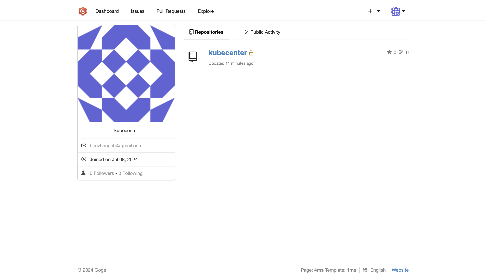

# Kubecenter: a K8s Cluster Management Web App

This is a K8S Cluster management web app built with Go. It enables the developers to **manage the K8S clusters without creating `.yaml` files or even runing the commands on the nodes** on the servers. Visit [Kubecenter](http://23.251.33.66:7080/swagger/index.html#/)
to see the Swagger API doc and test the APIs. **Prometheus** is also integrated for monitoring the cluster CPU/memory usages. Visit the [Prometheus UI](http://23.251.33.63:30090/graph) to see the graphs. 
Type `custer_cpu` or `cluster_mem` to see the graphs. My K8s cluster consists of one master node and two worker nodes.

## Language/Framework/Tools/IDE

+ Deployment: `Docker`, `Docker Compose`, `Gogs`, `Drone`, `AWS EC2`
+ Language: `Go 1.22.5 darwin/amd64`
+ API Documentation: `Swagger`
+ Backend Framework: `Gin v1.10.0`
+ IDE: `GoLand`
+ Tools/Middlewares/Libraries:
  + `client-go`: Go clients for talking to K8S cluster
  + `K8s`: for creating cluster and recource management
  + `Gogs` + `Drone`: for createing an automated CI/CD pipeline
  + `harbor`: for creating private image registry
  + `Go Testing`: for unit tests
  + `Prometheus`: for monitoring cluster CPU/memory usages
  + `dotenv`: for reading in env variables from `.env`

## Highlights:
+ Created a Docker image registry using **Harbor** and established a **CI/CD pipeline** using Gogs and Drone,
  enabling private image storage and automated integration/deployment
+ Integrated **Prometheus** to monitor Cluster CPU/Memory usages, enhancing operational observability
+ Built a customized **IoC (Inverse of Control) module** for dependency injection and decoupling of application
  components
  - *IoC module could be a open-source project. I used it in all my Go projects*

## Architecture

*Not all APIs are included below, visit [Kubecenter](http://23.251.33.66:7080/swagger/index.html#/)
to see the Swagger API doc.*

## CI/CD Pipeline: disgram to be updated

*Below is just presenting the UI of harbor, gogs, and drone, techinical details will be shared soon.*

### harbor, gogs, drone

## What I'm working on now

+ **cache**: use `Redis` to cache up the cluster info
+ **audit service**: create/update/delete operations should be audited first, this should be a **microservice**